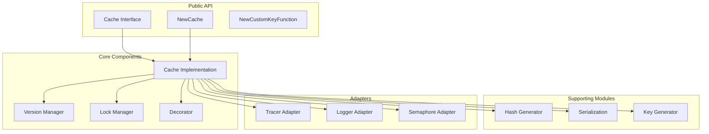

# Go Cache Library

A production-ready, framework-agnostic Go caching library with Redis backend, versioning, distributed locking, and decorator pattern support.

> **⚠️ Note**: Before release v1.0.0, backward compatibility is not guaranteed. The API may change between versions without maintaining backward compatibility. Please use dependency management tools (like Go modules) to pin specific versions for production use.

## Features

- **Redis-Based Caching**: Fast, distributed caching using Redis
- **Version-Based Invalidation**: Efficient cache invalidation without deleting individual keys
- **Distributed Locking**: Prevents cache stampede with Redis-based locks
- **Decorator Pattern**: Automatic function result caching with clean API
- **Custom Key Generation**: Flexible cache key strategies
- **Optional Observability**: Interface-based design for Tracer/Logger (no forced dependencies)
- **Dynamic TTL**: Support for both fixed and function-based TTL
- **Concurrency Control**: Built-in semaphore for controlling concurrent cache operations
- **Thread-Safe**: Concurrent access with proper locking
- **Pipeline Support**: Redis pipeline support for batch operations

## Installation

```bash
go get github.com/adityakw90/go-cache
```

## Quick Start

```go
package main

import (
    "context"
    "time"
    
    "github.com/adityakw90/go-cache"
    "github.com/go-redis/redis/v8"
)

func main() {
    // Create Redis client
    redisClient := redis.NewClient(&redis.Options{
        Addr: "localhost:6379",
    })
    
    // Create cache instance
    c, err := cache.NewCache(
        redisClient,
        cache.WithKeyPrefix("myapp"),
        cache.WithExpireDefault(5 * time.Minute),
    )
    if err != nil {
        panic(err)
    }
    
    // Define a function to cache
    getUserFromDB := func(ctx context.Context, args ...interface{}) (interface{}, error) {
        userID := args[0].(string)
        // ... fetch from database
        return &User{ID: userID, Name: "John"}, nil
    }
    
    // Create custom key function
    customKeyFunc, err := cache.NewCustomKeyFunction(
        "getUser",
        func(args ...interface{}) string {
            return "user:" + args[0].(string)
        },
        []string{"userID"},
    )
    if err != nil {
        panic(err)
    }
    
    // Create cached function
    cachedGetUser := c.Cached(
        "getUser",
        10 * time.Minute,
        true, // versioning enabled
        "user",
    )(
        getUserFromDB,
        customKeyFunc,
    )
    
    // Use the cached function
    ctx := context.Background()
    var user *User
    result, err := cachedGetUser(&user, ctx, "user-123")
    if err != nil {
        panic(err)
    }
    
    // Cache hit on subsequent calls
    var user2 *User
    result, err = cachedGetUser(&user2, ctx, "user-123")
    // Returns cached value, doesn't call getUserFromDB
}
```

## Configuration Options

The library uses functional options for flexible configuration:

```go
cache, err := cache.NewCache(
    redisClient,
    cache.WithKeyPrefix("myapp"),                    // Cache key prefix (default: "CACHE")
    cache.WithExpireDefault(5 * time.Minute),        // Default TTL for cache entries (default: 1 minute)
    cache.WithVersionExpire(30 * 24 * time.Hour),    // TTL for version keys (default: 30 days)
    cache.WithLockDuration(time.Minute),             // Lock timeout duration (default: 1 minute)
    cache.WithLockInterval(100 * time.Millisecond),  // Lock retry interval (default: 100ms)
    cache.WithSemaphoreSize(10),                     // Semaphore size for concurrency control (default: 10)
    cache.WithTracer(myTracer),                      // Optional tracer (default: no-op)
    cache.WithLogger(myLogger),                      // Optional logger (default: no-op)
    cache.WithSemaphore(mySemaphore),               // Optional custom semaphore (default: channel-based)
    cache.WithKeyGenerator(myKeyGenerator),          // Optional custom key generator
    cache.WithKeyVersionGenerator(myVersionGenerator), // Optional custom versioned key generator
    cache.WithVersionGenerator(myVersionGenerator),    // Optional custom version key generator
    cache.WithLockGenerator(myLockGenerator),        // Optional custom lock key generator
)
```

### Configuration Option Details

| Option | Type | Default | Description |
|--------|------|---------|-------------|
| `WithKeyPrefix` | `string` | `"CACHE"` | Prefix for all cache keys |
| `WithExpireDefault` | `time.Duration` | `1 * time.Minute` | Default TTL for cache entries |
| `WithVersionExpire` | `time.Duration` | `30 * 24 * time.Hour` | TTL for version keys |
| `WithLockDuration` | `time.Duration` | `1 * time.Minute` | Maximum time to wait for lock acquisition |
| `WithLockInterval` | `time.Duration` | `100 * time.Millisecond` | Interval between lock acquisition retries |
| `WithSemaphoreSize` | `int` | `10` | Size of semaphore for concurrency control |
| `WithTracer` | `Tracer` | `NoOpTracer` | Tracer for distributed tracing |
| `WithLogger` | `Logger` | `NoOpLogger` | Logger for observability |
| `WithSemaphore` | `Semaphore` | Channel-based | Custom semaphore implementation |
| `WithKeyGenerator` | `KeyGeneratorFunc` | Default generator | Custom key generator function |
| `WithKeyVersionGenerator` | `KeyGeneratorFunc` | Default generator | Custom versioned key generator |
| `WithVersionGenerator` | `KeyGeneratorFunc` | Default generator | Custom version key generator |
| `WithLockGenerator` | `KeyGeneratorFunc` | Default generator | Custom lock key generator |

## Cache Invalidation

Invalidate cache entries using the `CleanCache` method. This increments the version for all cache entries associated with a key name, effectively invalidating them:

```go
// Invalidate all cache entries for a key name
err := c.CleanCache(ctx, "getUser", nil, nil, true, nil)
if err != nil {
    log.Printf("Failed to invalidate cache: %v", err)
}

// Invalidate cache with custom key parameters
params := map[string]interface{}{
    "userID": "user-123",
}
err = c.CleanCache(ctx, "getUser", params, nil, true, nil)

// Use Redis pipeline for batch invalidation
session := redisClient.Pipeline()
var lockedKeys []string
err = c.CleanCache(ctx, "getUser", nil, session, false, &lockedKeys)
// ... add more operations to pipeline ...
_, err = session.Exec(ctx)
```

### CleanCache Parameters

- `ctx`: Context for the operation
- `key`: The cache key name registered with `Cached()`
- `params`: Parameters map for custom key functions (can be `nil`)
- `session`: Redis pipeline session (can be `nil` to create a new one)
- `execute`: Whether to execute the pipeline immediately (`true`) or defer execution
- `listLockedKey`: Pointer to slice that will collect lock keys for batch operations

**Note**: When using custom key functions, provide the `params` map with the required parameters. The method will invalidate all namespaces generated by the custom key functions.

## Observability Integration

The library provides interfaces for optional observability integration. If no tracer/logger is provided, the library uses no-op implementations.

### Tracer Interface

```go
type Tracer interface {
    StartSpan(ctx context.Context, name string) (context.Context, Span)
    NewSpanFromSpan(ctx context.Context, name string, parent Span) (context.Context, Span)
}

type Span interface {
    End()
    AddEvent(name string, attrs ...SpanAttribute)
    SetAttributes(attrs ...SpanAttribute)
    SpanContext() SpanContext
}

type SpanContext interface {
    TraceID() string
    SpanID() string
}
```

### Logger Interface

```go
type Logger interface {
    Info(msg string, fields map[string]interface{})
    Error(msg string, fields map[string]interface{})
    Debug(msg string, fields map[string]interface{})
    WithSpanContext(spanContext SpanContext) Logger
}
```

### Semaphore Interface

The library uses a semaphore interface for concurrency control:

```go
type Semaphore interface {
    Size() int
    Acquire()
    Release()
}
```

By default, a channel-based semaphore is created. You can provide a custom implementation using `WithSemaphore()`.

## Dynamic TTL

Support for both fixed and function-based TTL. When using a function, the TTL is calculated based on the result and arguments:

```go
// Fixed TTL
cachedFunc := c.Cached(
    "getUser",
    10 * time.Minute, // Fixed TTL
    true,
    "user",
)(getUserFromDB, customKeyFunc)

// Dynamic TTL function
ttlFunc := func(result interface{}, args ...interface{}) time.Duration {
    if user, ok := result.(*User); ok {
        if user.IsPremium {
            return 1 * time.Hour // Premium users cached longer
        }
    }
    return 10 * time.Minute // Regular users cached shorter
}

cachedFunc := c.Cached(
    "getUser",
    ttlFunc, // Dynamic TTL function
    true,
    "user",
)(getUserFromDB, customKeyFunc)
```

The TTL function receives:
- `result`: The result returned by the cached function
- `args`: The arguments passed to the cached function

If the TTL function returns a non-positive duration, the default TTL (`ExpireDefault`) is used.

## API Reference

### Cache Interface

```go
type Cache interface {
    // Get retrieves a value from cache by key and deserializes it into resultType
    Get(ctx context.Context, key string, resultType interface{}) error
    
    // Set stores a value in cache with the specified TTL
    Set(ctx context.Context, key string, value interface{}, ttl time.Duration) error
    
    // CleanCache invalidates cache entries by incrementing version
    CleanCache(ctx context.Context, key string, params map[string]interface{}, 
               session redis.Pipeliner, execute bool, listLockedKey *[]string) error
    
    // Cached creates a cached version of a function
    Cached(keyName string, ttl interface{}, versioning bool, prefix string) 
        func(fn func(ctx context.Context, args ...interface{}) (interface{}, error), 
             customKeyFunc CustomKeyFunction) 
        func(resultType interface{}, ctx context.Context, args ...interface{}) 
        (interface{}, error)
}
```

### Custom Key Function

```go
// NewCustomKeyFunction creates a custom key function for flexible cache key generation
customKeyFunc, err := cache.NewCustomKeyFunction(
    "getUser",                    // Name of the key function
    func(args ...interface{}) string {
        return "user:" + args[0].(string) // Custom key generation logic
    },
    []string{"userID"},          // Required parameter names
)
```

### Error Handling

The library exports several error types for better error handling:

```go
// Cache operation errors
var ErrGetCacheMiss  // Returned when Get() is called on a non-existent key

// Configuration errors
type InvalidConfigError

// Lock errors
var ErrLockAcquireFailed
var ErrLockReleaseUnlocked
var ErrLockReleaseForbidden

// Serialization errors
var ErrSerializeNilValue
var ErrDeserializeEmptyData
var ErrDeserializeResultNil

// Custom key function errors
var ErrNameRequired
var ErrCallableRequired
var ErrParamsRequired
var ErrKeyGeneratorParamsPrefixRequired
var ErrKeyGeneratorParamsKeyRequired
var ErrKeyGeneratorParamsNamespaceRequired
var ErrKeyGeneratorParamsVersionRequired
```

Example error handling:

```go
// When using Get() directly
var result MyType
err := c.Get(ctx, "mykey", &result)
if err != nil {
    if err == cache.ErrGetCacheMiss {
        // Cache miss - key doesn't exist
        log.Println("Cache miss occurred")
    } else {
        // Other error (network, serialization, etc.)
        log.Printf("Error: %v", err)
    }
}

// When using Cached() decorator, errors are handled internally
// The function is called on cache miss, so you only need to handle function errors
result, err := cachedFunc(&user, ctx, "user-123")
if err != nil {
    // This is an error from the underlying function, not cache operations
    log.Printf("Function error: %v", err)
}
```

## Architecture

The library follows an interface-based design with clear separation of concerns:



### Component Overview

- **Cache Core**: Main cache implementation with Redis operations (`Get`, `Set`, `CleanCache`)
- **Version Manager**: Version-based cache invalidation without deleting individual keys
- **Lock Manager**: Distributed locking to prevent cache stampede (multiple requests for same cache miss)
- **Decorator Pattern**: Automatic function result caching with `Cached()` method
- **Hash Generator**: Consistent hash-based cache keys from function arguments
- **Serialization**: Gob encoding for complex types
- **Key Generator**: Flexible key generation with support for custom generators
- **Adapters**: Pluggable tracer, logger, and semaphore interfaces

## Advanced Usage

### Direct Cache Operations

You can use `Get` and `Set` methods directly without the decorator pattern:

```go
// Store a value directly
err := c.Set(ctx, "mykey", myValue, 10*time.Minute)

// Retrieve a value directly
var result MyType
err := c.Get(ctx, "mykey", &result)
if err != nil {
    if err == cache.ErrGetCacheMiss {
        // Key doesn't exist
    } else {
        // Other error
    }
}
```

### Custom Key Generators

You can provide custom key generator functions for fine-grained control over cache key generation:

```go
customKeyGen := func(data map[string]string) (string, error) {
    prefix := data["prefix"]
    namespace := data["namespace"]
    version := data["version"]
    key := data["key"]
    return fmt.Sprintf("%s:%s:v%s:%s", prefix, namespace, version, key), nil
}

cache, err := cache.NewCache(
    redisClient,
    cache.WithKeyVersionGenerator(customKeyGen),
)
```

### Pipeline Operations

Use Redis pipelines for batch operations:

```go
session := redisClient.Pipeline()
var lockedKeys []string

// Batch invalidate multiple cache keys
err := c.CleanCache(ctx, "getUser", nil, session, false, &lockedKeys)
err = c.CleanCache(ctx, "getOrder", nil, session, false, &lockedKeys)

// Execute all operations atomically
_, err = session.Exec(ctx)
```

## Testing

Run tests:

```bash
go test ./...
```

Run tests with coverage:

```bash
go test -race -covermode=atomic -coverprofile=coverage.txt ./...
```

Run integration tests (requires Redis):

```bash
go test ./test/integration/...
```

Run end-to-end tests:

```bash
go test ./test/e2e/...
```

## Performance Considerations

1. **Version-Based Invalidation**: Instead of deleting individual keys, incrementing versions makes invalidation O(1) regardless of cache size
2. **Distributed Locking**: Prevents cache stampede when multiple requests miss the cache simultaneously
3. **Semaphore Control**: Limits concurrent cache operations to prevent resource exhaustion
4. **Pipeline Support**: Batch operations reduce network round-trips
5. **Gob Serialization**: Efficient binary serialization for complex Go types

## Best Practices

1. **Use Custom Key Functions**: For better cache key organization and invalidation granularity
2. **Enable Versioning**: Always enable versioning (`versioning: true`) for production use
3. **Set Appropriate TTLs**: Balance between cache freshness and hit rates
4. **Monitor Cache Performance**: Use tracer and logger to monitor cache hits/misses
5. **Handle Errors Gracefully**: Always check for `ErrGetCacheMiss` vs other errors
6. **Use Contexts**: Pass contexts through for proper cancellation and timeout handling

## Requirements

- Go 1.22+
- Redis server (6.0+ recommended)
- `github.com/go-redis/redis/v8`

## License

This project is licensed under the MIT License - see the [LICENSE](LICENSE) file for details.

## Contributing

Contributions are welcome! Please see [CONTRIBUTING.md](CONTRIBUTING.md) for guidelines on how to contribute to this project.

---

